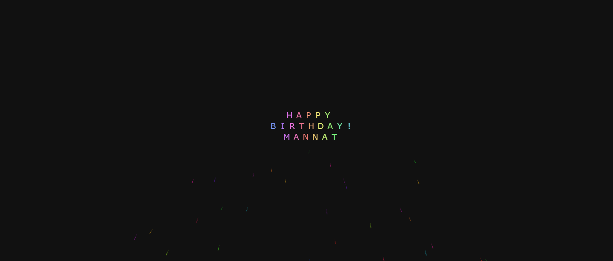

# Magical Wishes

Magical Wishes is a delightful web application that lets users create, send, and share magical birthday wishes. With its charming interface and customizable features, it adds a touch of joy and warmth to every celebration. Perfect for spreading positivity and love, Magical Wishes makes birthdays even more special!

## How It Works

1. **Fireworks Creation**: Fireworks particles are spawned from a random location and follow a set trajectory, creating an explosion effect.
2. **Balloon Animation**: Balloons are spawned and float along animated paths, adding motion to the scene.
3. **Text Animation**: The text is split into characters, each of which is animated individually to create the illusion of being drawn by fireworks and balloons.
4. **Interactive Animation**: The fireworks and balloons continuously animate, creating a lively and ever-changing visual environment.

## Demo

Check out the live demo of the animation in action:

Explore the magic by trying out the demo of the app. Experience how you can send personalized birthday wishes to your loved ones.

## Features

- **Personalized Wishes**: Customize your birthday wishes with unique messages and magical designs.
- **Easy to Use**: Simple and intuitive interface that lets users quickly create and send wishes.
- **History of Wishes**: View previously sent birthday wishes in an elegant and interactive format.
- **Shareable**: Send magical wishes via social media or as private messages to friends and family.
- **Notifications**: Get reminders for upcoming birthdays and never miss a chance to send a magical wish.
- **Responsive Design**: Fully responsive for a smooth experience on both desktop and mobile devices.

## Components

- **Canvas Element**: The primary rendering surface for all animations.
- **Fireworks**: Randomly generated fireworks explode across the canvas with customizable particles.
- **Balloon Paths**: Balloons follow animated paths and interact with the environment.
- **Text Rendering**: The specified text is drawn letter by letter, synchronized with the fireworks and balloons.
- **Particle Effects**: Use of particles to simulate fireworks and other animated effects.

## Contributing

We welcome contributions to make Magical Wishes even more magical! Here’s how you can contribute:

1. Fork the repository.
2. Create a new branch (`git checkout -b feature-branch`).
3. Commit your changes (`git commit -m 'Add new feature'`).
4. Push to the branch (`git push origin feature-branch`).
5. Open a pull request.

Feel free to submit issues or suggest features to improve the app!

---

**Note**: Magical Wishes is a work in progress, and additional features will be added over time to make it even more fun and interactive! Stay tuned for updates!
